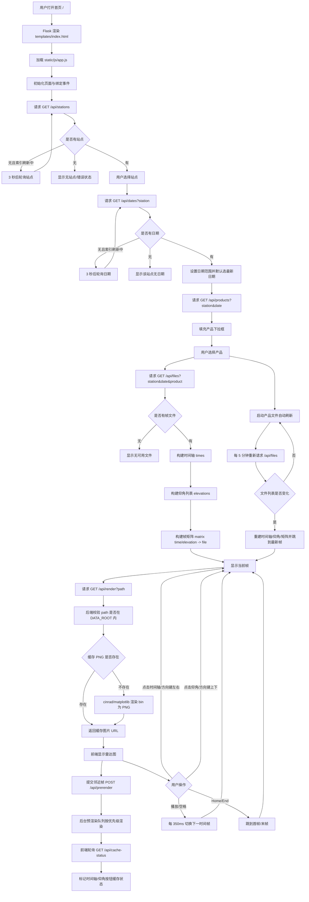

# 网站流程图

## 用户浏览与渲染流程

## 流程说明

1. 用户打开首页 `/`，Flask 返回 `templates/index.html`，浏览器加载 `static/js/app.js`。
2. 前端依次请求站点、日期、产品和文件列表 API，形成可浏览的时间轴、仰角列表和帧矩阵。
3. 用户选择或切换帧时，前端请求 `/api/render?path=...`，后端校验路径并把 bin 文件渲染为缓存 PNG。
4. 前端显示 `/cache/<png>` 图片，同时提交邻近帧到 `/api/prerender` 做后台预渲染。
5. 播放、键盘切换、时间轴点击和仰角切换都会回到“选择当前帧 -> 渲染/读取缓存 -> 显示图片”的循环。
6. 选择产品后，前端每 5 分钟刷新一次文件列表；发现新文件时自动重建列表并跳到最新帧。
